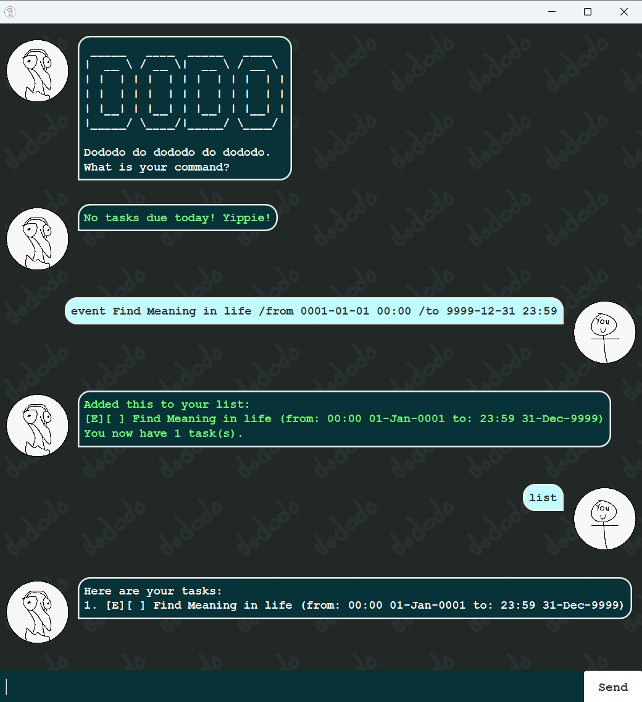

# Dodo User Guide



## Formatting

`CAPITALISED TERMS` in this guide represent the user's input parameters.

e.g. `todo NAME`, `NAME` is the user's given name for the task, e.g. `todo Eat`

`DATE` parameters need the form yyyy-mm-dd. e.g. `2025-03-12`

`TIME` parameters need the form hh:mm in a 24-hours clock e.g. `23:59`

Commands that have no trailing terms will be considered invalid if used with trailing terms.

e.g. `help` is valid, but `help 123` will not be considered valid.

Refrain from using `/` in your input parameters.

## Help
Type `help` for a brief overview of all the commands.

## Todo tasks

Simple tasks without time limits.

Adding format: `todo NAME`, e.g `todo Read Lord of the Rings`

Dodo will show you a todo task as such:

```
[T][ ] Read Lord of the Rings
```
## Deadline tasks

Tasks with a single deadline.

Adding format: `deadline NAME /by DATE TIME`

e.g `deadline Assignment 2 /by 2025-02-25 23:59`

Dodo will show you a deadline task as such:

```
[D][ ] Assignment 2 (by: 23:59 25-Feb-2025)
```

## Event tasks

Tasks with a start and end time.

Adding format: `event NAME /from DATE TIME /to DATE TIME`

e.g `event Hackathon /from 2025-02-25 12:00 /to 2025-02-26 08:30`

Dodo will show you an event task as such:

```
[E][ ] Hackathon (from: 12:00 25-Feb-2025 to: 08:30 26-Feb-2025)
```

## List tasks

Type `list` for Dodo to show you your task list.
```
Here are your tasks:
1. [T][ ] Eat
2. [D][ ] Sleep (by: 21:00 23-Mar-2030)
3. [E][ ] Repeat (from: 00:00 01-Jan-1000 to 23:59 29-Dec-2030)
```

## Deleting tasks

Type `delete TASK_NUMBER` to delete a task.

`TASK_NUMBER` is the number of the task shown by the `list` command.

e.g. `delete 3` will delete the Repeat event below.
```
Here are your tasks:
1. [T][ ] Eat
2. [D][ ] Sleep (by: 21:00 23-Mar-2030)
3. [E][ ] Repeat (from: 00:00 01-Jan-1000 to 23:59 29-Dec-2030)
```

## Marking/Unmarking tasks

Type `mark TASK_NUMBER` or `unmark TASK_NUMBER` to mark a task as done/not done.

`TASK_NUMBER` is the number of the task shown by the `list` command.

A marked task looks like:
```
[T][X] Eat
```

A unmarked task looks like:
```
[T][ ] Eat
```
## Find a task

Type in `find NAME` to get Dodo to show you a list of tasks with the same name (case-insensitive).

Partially accurate names will also be included.

e.g. the task below will be shown for a `NAME` of `h`, `o`, or `ho`
```
[T][ ] ho
```

## Due command

Type in `due DATE` to get Dodo to show you a list of tasks due/ongoing on that date.

Todo tasks will not be shown.

Deadline tasks will be shown if due on the same date. 

Events will be shown if the given date falls between or on its start and end dates.

e.g. `due 2030-03-23` will return tasks 2 and 3 below.
```
Here are your tasks:
1. [T][ ] Eat
2. [D][ ] Sleep (by: 21:00 23-Mar-2030)
3. [E][ ] Repeat (from: 00:00 01-Jan-1000 to 23:59 29-Dec-2030)
```

## Reminders

Dodo will remind you of any tasks due today after startup.

## Bye command

Type `bye` or `bb` to quit program.